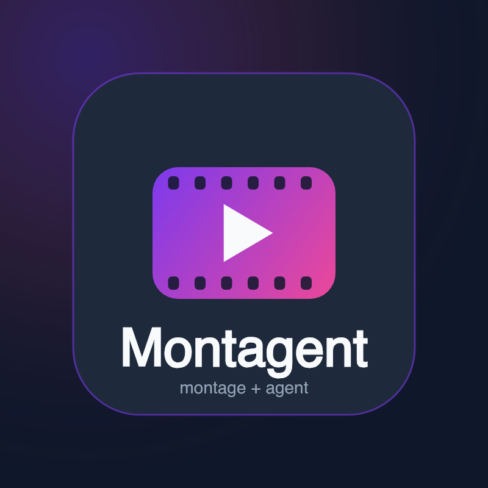

<p align="center">
  
</p>

# Montagent

**Montagent** (montage + agent) is an AI-agent-driven, instruction-led video production
system — the agent reads a brief and orchestrates a pipeline of tools (research → script →
assets → edit → compose) to turn an idea into a finished video.

Montagent runs on Node.js 22+ / TypeScript (ESM) — no Python required. The agent drives a
declarative pipeline of typed tools with capability discovery, checkpoints, and a free
(zero-API-key) Remotion demo flow out of the box. The CLI is `montagent`; `make` targets
wrap it.

**Hard requirement honored:** behavioral 1:1 parity with the Python original, *except*
local GPU/PyTorch inference is dropped (its capabilities are covered by cloud-API sibling tools).

---

## Status — vertical slice (free flow proven end-to-end)

| Layer | State |
|---|---|
| **M0 foundation** | ✅ pnpm workspace · tsconfig (ESM/NodeNext/strict) · Makefile (13 targets, names 1:1) · `montagent` CLI |
| **M1 framework** | ✅ `base_tool` contract · `tool_registry` (full port) · `cost_tracker` · `checkpoint` (ajv, **reuses the 24 JSON schemas verbatim**) · `config` (zod) · pipeline/playbook loaders |
| **M3 free render path** | ✅ Remotion **programmatic** render via `@remotion/renderer` (replaces `npx remotion render`) — real mp4 verified |
| **Representative tools** | ✅ `video_compose` (runtime detection), `elevenlabs_tts` (HTTP→fetch pattern), `flux_image` |
| **M2 / M3-full / M4 / M5** | ⏳ remaining ~110 provider tools, full FFmpeg/HyperFrames orchestration, CV/CPU-ML tools, skill-command codemod — see the task list |

The **complete free (zero-API-key) flow** is implemented and verified: `preflight → demo --list → demo <name>`.

---

## Quickstart

```bash
make setup          # pnpm install (app + remotion-composer workspace) + create .env
make preflight      # capability/provider menu  (montagent preflight)
make demo-list      # list the zero-key demos
make demo           # render all 3 demos to projects/demos/renders/*.mp4 — NO API keys
make test           # vitest (contract + tool tests)
make lint           # tsc --noEmit
```

Direct CLI (same binary the Makefile uses):

```bash
./bin/montagent preflight --summary       # compact "N of M configured" rollup
./bin/montagent catalog --by-capability
./bin/montagent runtimes                  # ffmpeg / remotion / hyperframes availability
./bin/montagent demo focusflow-pitch      # render one demo (free)
./bin/montagent run <tool> --params '{}'  # generic tool execution
```

## The free flow

`make demo` renders checked-in JSON props (`remotion-composer/public/demo-props/*.json`)
through the `Explainer` Remotion composition using a local headless Chromium — no API key,
no paid service. Output: 1920×1080 @ 30fps, h264, duration derived from the props.

## Project layout

```
src/
  tools/        base_tool.ts (contract) · tool_registry.ts · index.ts (explicit discovery)
                cost_tracker.ts · video/ tts/ image/ (representative tools)
  lib/          checkpoint.ts · config.ts · pipeline_loader.ts · schema_validator.ts
  styles/       playbook_loader.ts
  remotion/     render.ts (programmatic @remotion/renderer)
  cli/          index.ts (commander)
schemas/        ★ reused verbatim from Python (24 JSON Schemas, validated by ajv)
pipeline_defs/  ★ reused verbatim (13 YAML)
styles/         ★ reused verbatim (4 playbooks)
remotion-composer/  ★ reused (already TS) — now in the pnpm workspace
bin/montagent     CLI launcher (tsx, no build step)
```

See [`ACCEPTANCE.md`](ACCEPTANCE.md) for the full verification report.
